# ❄️ ColdCache

**Decentralized Game Distribution Platform on Sui + Walrus**

ColdCache is a revolutionary gaming platform that combines blockchain technology with decentralized storage to create a secure, transparent, and user-owned gaming ecosystem. Built on Sui blockchain with Walrus decentralized storage and Seal encryption.

[](https://www.coldcache.xyz)
[](https://sui.io)
[](https://docs.walrus.app)

---

## 🎯 **What is ColdCache?**

ColdCache revolutionizes game distribution by:
- **🔐 Encrypting games** with Seal technology tied to NFT ownership
- **☁️ Storing games** on decentralized Walrus network (no central servers)
- **💎 Creating NFT ownership** that grants access to encrypted games
- **💰 Enabling direct revenue** for developers without intermediaries
- **🌐 Providing global access** via decentralized CDN

### **Core Features**
- 🎮 **Game Store** - Browse and purchase games with SUI cryptocurrency
- 📚 **Personal Library** - Access your owned games with NFT verification
- 📤 **Publisher Tools** - Upload and monetize your games directly
- 💰 **Revenue Dashboard** - Track sales and withdraw earnings
- 🔒 **Secure Downloads** - Encrypted files only accessible to NFT owners
- 🌍 **Decentralized** - No central authority or single point of failure

---

## 🏗️ **System Architecture**

```mermaid
graph TB
    subgraph "Frontend (React + TypeScript)"
        A["🎮 Game Store<br/>Browse & Purchase"]
        B["📤 Game Upload<br/>Publisher Tools"]
        C["📚 Library<br/>Owned Games"]
        D["💰 Publisher Dashboard<br/>Analytics & Revenue"]
    end
    
    subgraph "Blockchain Layer (Sui)"
        E["🏪 Game Store Contract<br/>NFT Marketplace"]
        F["🎯 NFT Contract<br/>Game Ownership"]
        G["💎 Revenue Management<br/>Publisher Earnings"]
    end
    
    subgraph "Storage Layer (Walrus)"
        H["☁️ Decentralized Storage<br/>Game Files & Assets"]
        I["🔐 Seal Encryption<br/>NFT-Gated Access"]
        J["🌐 CDN Access<br/>Global Distribution"]
    end
    
    A --> E
    B --> E
    B --> H
    C --> F
    C --> I
    D --> G
    E --> F
    H --> I
    I --> J
```



## 🔄 **Platform Flow**

```mermaid
graph LR
    subgraph "Upload Flow"
        A1["1. Select Game File<br/>🎮 Local File"]
        A2["2. Seal Encryption<br/>🔐 NFT-Gated Access"]
        A3["3. Walrus Upload<br/>☁️ Decentralized Storage"]
        A4["4. Mint NFT<br/>💎 Ownership Token"]
        A5["5. Store Listing<br/>🏪 Marketplace"]
    end
    
    subgraph "Purchase Flow"
        B1["1. Browse Store<br/>🔍 Discover Games"]
        B2["2. Purchase Game<br/>💰 SUI Payment"]
        B3["3. Receive NFT<br/>🎯 Ownership Proof"]
        B4["4. Access Library<br/>📚 Download Games"]
    end
    
    subgraph "Security Layer"
        C1["🔒 Encrypted Storage<br/>Files protected by Seal"]
        C2["🎯 NFT Ownership<br/>Blockchain verification"]
        C3["🚫 Access Control<br/>Only owners can decrypt"]
    end
    
    A1 --> A2
    A2 --> A3
    A3 --> A4
    A4 --> A5
    
    B1 --> B2
    B2 --> B3
    B3 --> B4
    
    A2 --> C1
    A4 --> C2
    B4 --> C3
```



---

## 💻 **Tech Stack**

```mermaid
graph TD
    subgraph "Frontend Stack"
        A["⚛️ React 18<br/>UI Framework"]
        B["📘 TypeScript<br/>Type Safety"]
        C["🎨 Radix UI<br/>Component Library"]
        D["⚡ Vite<br/>Build Tool"]
        E["🎯 Custom Theme<br/>Igloo Design System"]
    end
    
    subgraph "Blockchain Integration"
        F["🏛️ Sui Blockchain<br/>Smart Contracts"]
        G["🔗 @mysten/dapp-kit<br/>Wallet Integration"]
        H["💎 @mysten/sui<br/>Blockchain SDK"]
        I["🔐 @mysten/seal<br/>Encryption Service"]
    end
    
    subgraph "Storage & CDN"
        J["☁️ Walrus Network<br/>Decentralized Storage"]
        K["📦 @mysten/walrus<br/>Storage SDK"]
        L["🌐 Aggregator CDN<br/>Global Distribution"]
    end
    
    subgraph "Deployment"
        M["▲ Vercel<br/>Frontend Hosting"]
        N["🎯 Custom Domain<br/>coldcache.xyz"]
        O["🔒 HTTPS/SSL<br/>Secure Connections"]
    end
    
    A --> B
    B --> C
    C --> D
    D --> E
    
    F --> G
    G --> H
    H --> I
    
    J --> K
    K --> L
    
    M --> N
    N --> O
    
    A -.-> G
    C -.-> K
    E -.-> M
```



### **Key Technologies**

| Component | Technology | Purpose |
|-----------|------------|---------|
| **Frontend** | React 18 + TypeScript | Modern, type-safe UI |
| **Styling** | Radix UI + Custom Theme | Beautiful, accessible components |
| **Blockchain** | Sui Network | Fast, low-cost smart contracts |
| **Storage** | Walrus Network | Decentralized file storage |
| **Encryption** | Mysten Seal | NFT-gated access control |
| **Wallet** | Sui Wallet Kit | Secure wallet integration |
| **Deployment** | Vercel | Global CDN deployment |

---

## 🚀 **Quick Start**

### **Prerequisites**
- Node.js 18+ 
- pnpm package manager
- Sui Wallet browser extension
- Git

### **1. Clone Repository**
```bash
git clone https://github.com/smuushi/ethglobalny2025-dvs.git
cd ethglobalny2025-dvs
```

### **2. Install Dependencies**
```bash
pnpm install
```

### **3. Set Up Sui Environment**
```bash
# Install Sui CLI (if not already installed)
curl -fLJO https://github.com/MystenLabs/sui/releases/latest/download/sui-mainnet-v1.0.0-ubuntu-x86_64.tgz

# Configure testnet environment
sui client new-env --alias testnet --rpc https://fullnode.testnet.sui.io:443
sui client switch --env testnet

# Create new address (if needed)
sui client new-address secp256k1

# Fund your address
# Visit: https://faucet.sui.io
```

### **4. Deploy Move Contracts (Optional)**

If you want to deploy your own contracts instead of using the existing ones:

```bash
# Deploy Game Store contract
cd move/game_store
sui client publish --gas-budget 100000000

# Deploy NFT contract  
cd ../nft
sui client publish --gas-budget 100000000

# Update src/constants.ts with your package IDs
```

### **5. Start Development Server**
```bash
pnpm dev
```

Visit `http://localhost:5173` to see ColdCache running locally! 🎉

---

## 🌐 **Production Deployment**

### **Frontend Deployment (Vercel)**

[](https://vercel.com/new/clone?repository-url=https://github.com/smuushi/ethglobalny2025-dvs)

**Manual Deployment:**
```bash
# Install Vercel CLI
npm i -g vercel

# Login and deploy
vercel login
vercel --prod
```

**Environment Variables** (optional):
- `VITE_NETWORK` - Network to use (`testnet` | `mainnet`)
- `VITE_SUI_RPC_URL` - Custom Sui RPC endpoint

### **Custom Domain Setup**
1. **Add domain** in Vercel dashboard
2. **Configure DNS** to point to Vercel
3. **SSL certificate** automatically provisioned

---

## 🎮 **Usage Guide**

### **For Gamers**

1. **🔗 Connect Wallet**
   - Install Sui Wallet extension
   - Connect to ColdCache
   - Fund wallet with SUI tokens

2. **🛒 Browse Store**
   - Explore available games
   - View game details and screenshots
   - Check prices and ratings

3. **💰 Purchase Games**
   - Click "Purchase" on desired game
   - Sign transaction with SUI payment
   - Receive game NFT in wallet

4. **📚 Access Library**
   - View owned games in Library
   - Secure download with NFT verification
   - Play downloaded games locally

### **For Publishers**

1. **📤 Upload Games**
   - Navigate to Publisher Dashboard
   - Fill game metadata (title, description, price)
   - Upload game file (ZIP, RAR, 7Z, TAR, EXE, DMG)
   - Upload cover image (optional)
   - Set price in SUI

2. **💰 Manage Revenue**
   - View sales analytics
   - Track total revenue
   - Withdraw earnings to wallet
   - Monitor game performance

3. **⚙️ Game Management**
   - Update game prices
   - Toggle game availability
   - Set maximum supply limits
   - Transfer ownership

---

## 🛠️ **Development**

### **Project Structure**
```
ColdCache/
├── src/
│   ├── components/          # Reusable UI components
│   ├── pages/              # Main application pages
│   ├── lib/                # Utility libraries
│   ├── schemas/            # TypeScript schemas
│   └── constants.ts        # Network configuration
├── move/                   # Sui Move smart contracts
│   ├── game_store/         # Main marketplace contract
│   ├── nft/               # NFT ownership contract
│   └── counter/           # Example counter contract
├── public/                # Static assets
└── docs/                  # Documentation
```

### **Key Components**

| File | Purpose |
|------|---------|
| `src/pages/HomePage.tsx` | Landing page and game discovery |
| `src/pages/StorePage.tsx` | Game marketplace and purchasing |
| `src/pages/LibraryPage.tsx` | Owned games and secure downloads |
| `src/pages/PublisherDashboard.tsx` | Publisher analytics and revenue |
| `src/GameUpload.tsx` | Game publishing and upload flow |
| `src/lib/seal.ts` | Seal encryption integration |
| `src/lib/walrus.ts` | Walrus storage configuration |

### **Smart Contracts**

| Contract | Purpose | Location |
|----------|---------|----------|
| **GameStore** | Marketplace, sales, revenue | `move/game_store/` |
| **NFT** | Game ownership tokens | `move/nft/` |

### **Development Commands**

```bash
# Development server
pnpm dev

# Type checking
pnpm build

# Linting
pnpm lint

# Smart contract deployment
cd move/game_store && sui client publish --gas-budget 100000000
cd move/nft && sui client publish --gas-budget 100000000
```

---

## 🔧 **Configuration**

### **Network Configuration**
Edit `src/constants.ts` to configure your deployment:

```typescript
// Game Store Package IDs
export const TESTNET_GAME_STORE_PACKAGE_ID = "0x1708e..."; // Your package ID
export const TESTNET_GAME_STORE_OBJECT_ID = "0x43e2d...";  // Your store object ID

// NFT Package IDs  
export const TESTNET_NFT_PACKAGE_ID = "0x4192d...";        // Your NFT package ID
```

### **Wallet Integration**
- **Supported Wallets**: Sui Wallet, Suiet, Martian, Ethos
- **Network**: Sui Testnet (configurable for Mainnet)
- **Currency**: SUI tokens for all transactions

### **File Limits**
- **Maximum file size**: 13.3 GiB (Walrus network limit)
- **Supported formats**: ZIP, RAR, 7Z, TAR, EXE, DMG
- **Image formats**: JPG, PNG, GIF, WebP

---

## 🔒 **Security Features**

### **Encryption & Access Control**
- **🔐 Seal Encryption**: Games encrypted with NFT-tied keys
- **🎯 Ownership Verification**: Blockchain-based access control
- **🚫 Piracy Prevention**: Direct CDN access blocked for encrypted files
- **💎 NFT Ownership**: Immutable proof of game ownership

### **Smart Contract Security**
- **👤 Publisher Controls**: Only publishers can modify their games
- **💰 Revenue Protection**: Automatic revenue distribution and withdrawal
- **🛡️ Access Validation**: Multi-layer ownership verification
- **⚡ Gas Optimization**: Efficient contract design

### **Storage Security**
- **🌐 Decentralized**: No single point of failure
- **🔄 Redundancy**: Multiple storage nodes ensure availability
- **🔐 Content Addressing**: Immutable file references
- **🛡️ Tamper Proof**: Cryptographic integrity verification

---

## 📦 **Smart Contract Deployment**

### **Deploy Game Store Contract**
```bash
cd move/game_store
sui client publish --gas-budget 100000000
```

**Expected Output:**
```bash
Successfully published package: 0x1708e46c71fc5805fbd6f04339bd04bc0566b85a73fd687d0481d686c127c5f6

Created Objects:
- GameStore: 0x43e2dbb0e907ac9a99de23e229879aa32074a0c1ef8f6a3283252fb2392202eb
```

### **Deploy NFT Contract**
```bash
cd move/nft  
sui client publish --gas-budget 100000000
```

### **Update Configuration**
Add the package IDs to `src/constants.ts`:
```typescript
export const TESTNET_GAME_STORE_PACKAGE_ID = "0x1708e..."; // Your package ID
export const TESTNET_GAME_STORE_OBJECT_ID = "0x43e2d...";  // GameStore object ID
export const TESTNET_NFT_PACKAGE_ID = "0x4192d...";        // NFT package ID
```

---

## 🎮 **Game Upload Requirements**

### **Supported File Types**
- **Archives**: ZIP, RAR, 7Z, TAR
- **Executables**: EXE (Windows), DMG (macOS)
- **Maximum Size**: 13.3 GiB per file

### **Game Metadata**
- **Title**: Game name (required)
- **Description**: Game description (required)
- **Price**: Price in SUI tokens (required)
- **Genre**: Category selection (required)
- **Cover Image**: JPG/PNG thumbnail (optional)

### **Upload Process**
1. **Encryption**: Game files encrypted with Seal
2. **Storage**: Files uploaded to Walrus network
3. **NFT Minting**: Publisher NFT created for management
4. **Store Listing**: Game appears in marketplace

---

## 🌟 **Features**

### **🛒 Game Store**
- Browse available games with filters
- View game details, screenshots, and metadata
- Purchase games with SUI cryptocurrency
- Automatic NFT minting on purchase

### **📚 Personal Library**
- View all owned game NFTs
- Secure download with ownership verification
- Game file decryption for NFT owners only
- Transfer games to other wallets

### **📊 Publisher Dashboard**
- Upload and publish new games
- Track sales and revenue analytics
- Withdraw earnings to wallet
- Manage game pricing and availability

### **🔐 Security System**
- Seal encryption prevents unauthorized access
- NFT ownership controls file decryption
- Secure download URLs with verification
- Anti-piracy protection

---

## 🐛 **Troubleshooting**

### **Common Issues**

**Wallet Connection Problems**
```bash
# Clear browser cache and cookies
# Reinstall Sui Wallet extension
# Switch to correct network (testnet)
```

**File Upload Failures**
```bash
# Check file size (max 13.3 GiB)
# Verify wallet has sufficient SUI for gas
# Try smaller files first for testing
# Check browser console for detailed errors
```

**Transaction Failures**
```bash
# Ensure wallet is funded with SUI
# Check gas budget settings
# Verify network connectivity
# Try again after a few minutes
```

**Download Issues**
```bash
# Verify NFT ownership in wallet
# Check browser console for errors
# Ensure stable internet connection
# Clear browser cache if needed
```

### **Development Debugging**

**Enable Verbose Logging**
```typescript
// In browser console
localStorage.setItem('debug', '*');
```

**Check Smart Contract State**
```bash
# View game store object
sui client object <GAME_STORE_OBJECT_ID>

# Check NFT ownership
sui client objects <YOUR_ADDRESS>
```

---

## 📚 **API Documentation**

### **Smart Contract Functions**

**Game Store Contract**
```move
// Publish a new game
public fun publish_game_entry(
    store: &mut GameStore,
    title: vector<u8>,
    description: vector<u8>,
    price: u64,
    walrus_blob_id: vector<u8>,
    cover_image_blob_id: vector<u8>,
    genre: vector<u8>,
    // ... metadata fields
)

// Purchase a game
public fun purchase_game(
    store: &mut GameStore,
    game_id: ID,
    payment: Coin<SUI>,
    recipient: address,
)

// Withdraw publisher revenue
public fun withdraw_revenue(
    game: &mut Game,
    amount: u64,
    recipient: address,
)
```

**NFT Contract**
```move
// Mint game NFT
public fun mint_game_nft(
    title: vector<u8>,
    description: vector<u8>,
    walrus_blob_id: vector<u8>,
    // ... metadata
)

// Transfer game NFT
public fun transfer_game(
    nft: GameNFT,
    recipient: address,
)
```

---

## 🤝 **Contributing**

### **Development Setup**
1. **Fork** the repository
2. **Create feature branch**: `git checkout -b feature/amazing-feature`
3. **Make changes** and test thoroughly
4. **Commit changes**: `git commit -m 'Add amazing feature'`
5. **Push branch**: `git push origin feature/amazing-feature`
6. **Open Pull Request** with detailed description

### **Code Standards**
- **TypeScript**: Strict type checking enabled
- **ESLint**: Code quality and consistency
- **Prettier**: Automatic code formatting
- **Testing**: Component and integration tests

### **Smart Contract Guidelines**
- **Gas optimization**: Efficient Move code
- **Security audits**: Thorough testing
- **Documentation**: Comprehensive comments
- **Upgradability**: Consider future improvements

---

## 📄 **License**

This project is licensed under the MIT License - see the [LICENSE](LICENSE) file for details.

---

## 🌟 **Acknowledgments**

- **Mysten Labs** for Sui blockchain, Walrus storage, and Seal encryption
- **Radix UI** for beautiful, accessible components
- **Vercel** for seamless deployment platform
- **Open Source Community** for incredible tools and libraries

---

## 📞 **Support & Community**

- **🐛 Issues**: [GitHub Issues](https://github.com/smuushi/ethglobalny2025-dvs/issues)
- **💬 Discussions**: [GitHub Discussions](https://github.com/smuushi/ethglobalny2025-dvs/discussions)
- **📧 Contact**: [Email Support](mailto:support@coldcache.xyz)
- **🐦 Updates**: [Twitter @ColdCache](https://twitter.com/coldcache)

---

## 🚀 **Future Roadmap**

- [ ] **Mobile App**: iOS and Android applications
- [ ] **Game Reviews**: Community rating system
- [ ] **Achievement System**: Blockchain-based achievements  
- [ ] **Multiplayer Support**: Decentralized game sessions
- [ ] **Creator Tools**: In-browser game development
- [ ] **Cross-Chain**: Multi-blockchain support
- [ ] **DAO Governance**: Community-driven platform evolution

---

<div align="center">

**🎮 Ready to revolutionize gaming? Start building on ColdCache today! 🎮**

[](https://vercel.com/new/clone?repository-url=https://github.com/smuushi/ethglobalny2025-dvs)
[](https://www.coldcache.xyz)

</div>